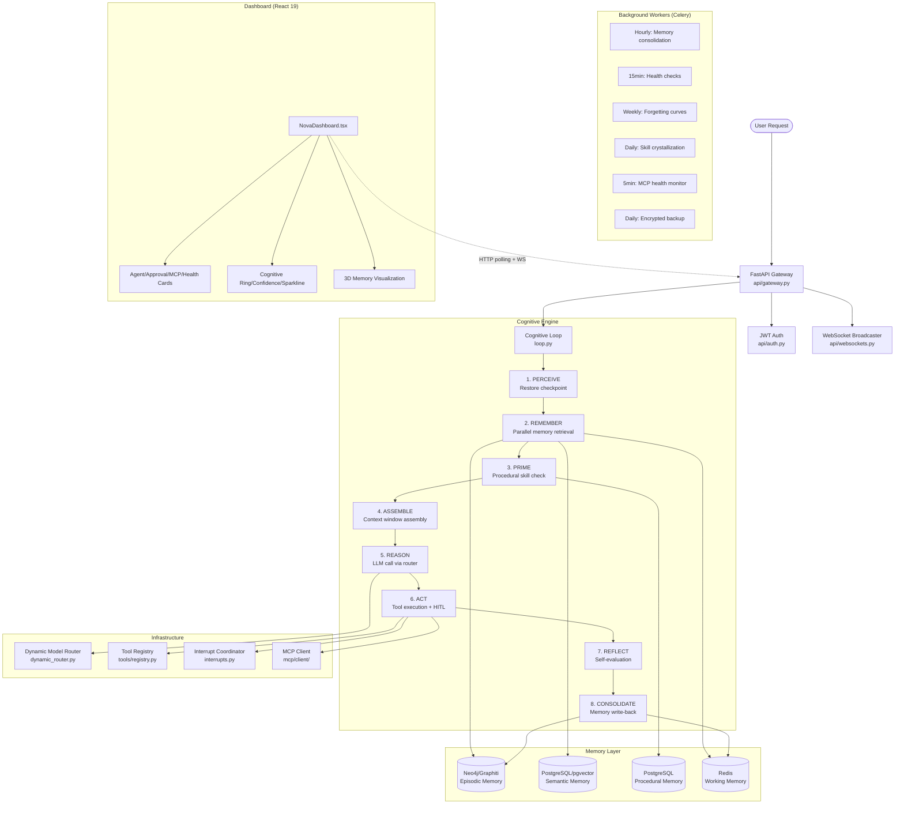

# SuperNova — System Architecture

## Architectural Pattern

SuperNova implements a **cognitive architecture** inspired by human memory systems, built on LangGraph's stateful graph orchestration with PostgreSQL checkpointing for durable execution.

### High-Level Architecture

## Design Principles

1. **Durable Execution** — LangGraph + AsyncPostgresSaver checkpointing. Process crashes resume from the interrupted step.
2. **Positional Context Optimization** — Context window assembly following Liu et al. (2023) primacy/recency attention topology.
3. **Capability-Gated Security** — Tools declare required capabilities; execution validates at call time with HITL for high-risk operations.
4. **Self-Improvement** — SkillCrystallizationWorker extracts repeated tool-call patterns from Langfuse traces and compiles them into reusable LangGraph subgraphs.
5. **Observable by Default** — Every LLM call and tool execution traced in Langfuse with full I/O capture.

## Layer Separation

| Layer | Location | Responsibility |
|-------|----------|---------------|
| Cognitive Core | `loop.py`, `context_assembly.py`, `procedural.py`, `dynamic_router.py`, `interrupts.py` | Agent reasoning, memory retrieval, context assembly, model routing, safety |
| API | `supernova/api/` | HTTP/WS endpoints, auth, routing |
| Memory | `supernova/core/memory/` | Episodic, semantic, working memory stores |
| Infrastructure | `supernova/infrastructure/` | Storage, tools, security, observability, LLM cost control |
| Workers | `supernova/workers/` | Celery background tasks (consolidation, maintenance, monitoring) |
| MCP | `supernova/mcp/` | Model Context Protocol client and tool bridge |
| Skills | `supernova/skills/` | Skill file discovery, loading, hot-reload |
| Dashboard | `dashboard/src/` | React 19 monitoring UI with 3D visualizations |

## State Management

The agent's state is defined as `AgentState(TypedDict)` in `loop.py`:
- `messages`: Conversation history (Annotated with `operator.add` for immutable append)
- `session_id`, `thread_id`: Session tracking
- `memory_context`: Retrieved memories from all stores
- `active_plan`: Current execution plan
- `tool_calls_this_turn`: Safety counter (max 15 per turn)
- `reflection_critique`: Self-evaluation output
- `metadata`: Extensible metadata dict

All state transitions are pure functions returning dicts that merge into AgentState, making the graph fully checkpointable and unit-testable.
