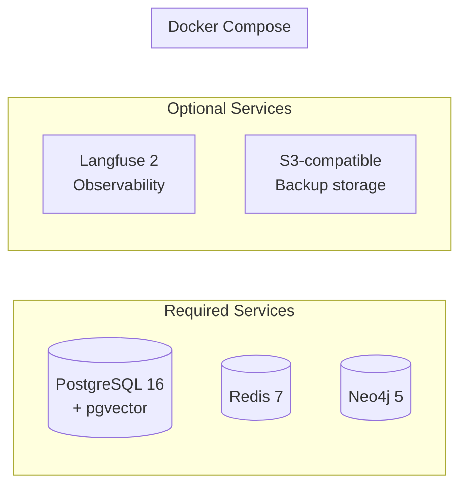

# SuperNova — Dependencies

## Python Runtime Dependencies

### Core Agent Orchestration
| Package | Version | Purpose |
|---------|---------|---------|
| langgraph | ≥0.2.0 | Stateful agent graph with checkpointing |
| langgraph-checkpoint-postgres | ≥0.1.0 | PostgreSQL checkpoint backend |
| langchain-core | ≥0.3.0 | Core LangChain components |

### LLM Routing
| Package | Version | Purpose |
|---------|---------|---------|
| litellm | ≥1.40.0 | Universal LLM proxy (100+ providers) |
| openai | ≥1.30.0 | OpenAI API client |
| tiktoken | ≥0.7.0 | Token counting |

### Memory Systems
| Package | Version | Purpose |
|---------|---------|---------|
| graphiti-core | ≥0.3.0 | Temporal knowledge graph (episodic memory) |
| asyncpg | ≥0.29.0 | Async PostgreSQL driver |
| sqlalchemy[asyncio] | ≥2.0.0 | ORM for database operations |
| redis[hiredis] | ≥5.0.0 | Working memory + Celery broker |
| neo4j | ≥5.20.0 | Neo4j driver for episodic memory |
| numpy | ≥1.26.0 | Numerical operations (embeddings) |

### API Layer
| Package | Version | Purpose |
|---------|---------|---------|
| fastapi | ≥0.111.0 | HTTP/WS API framework |
| uvicorn[standard] | ≥0.29.0 | ASGI server with uvloop |
| websockets | ≥12.0 | WebSocket support |
| python-jose[cryptography] | ≥3.3.0 | JWT authentication |
| pydantic | ≥2.7.0 | Data validation |
| pydantic-settings | ≥2.2.0 | Environment configuration |

### Background Tasks
| Package | Version | Purpose |
|---------|---------|---------|
| celery[gevent] | ≥5.4.0 | Background task execution |
| celery-redbeat | ≥2.2.0 | Redis-backed Celery Beat scheduler |

### Observability & Serialization
| Package | Version | Purpose |
|---------|---------|---------|
| langfuse | ≥2.0.0 | Observability and tracing |
| structlog | ≥24.1.0 | Structured logging |
| msgpack | ≥1.0.8 | Binary serialization for working memory |
| httpx | ≥0.27.0 | Async HTTP client |
| orjson | ≥3.10.0 | Fast JSON serialization |

### MCP
| Package | Version | Purpose |
|---------|---------|---------|
| mcp | ≥1.0.0 | Model Context Protocol client |

## Python Dev Dependencies

| Package | Purpose |
|---------|---------|
| pytest | Test framework |
| pytest-asyncio | Async test support |
| pytest-cov | Coverage measurement |
| ruff | Linting + formatting |
| mypy | Static type checking |

## Frontend Dependencies

### Runtime
| Package | Version | Purpose |
|---------|---------|---------|
| react | ^19.2.0 | UI framework |
| react-dom | ^19.2.0 | DOM rendering |
| three | ^0.183.1 | 3D graphics |
| @react-three/fiber | ^9.5.0 | React Three.js bindings |
| @react-three/drei | ^10.7.7 | Three.js helpers |
| gsap | ^3.14.2 | Animation library |

### Dev
| Package | Version | Purpose |
|---------|---------|---------|
| vite | ^7.3.1 | Build tool and dev server |
| vitest | ^3.2.4 | Unit testing |
| @playwright/test | ^1.56.1 | E2E testing |
| typescript | ^5.8.3 | Type checking |
| eslint | ^9.39.1 | Linting |

## Infrastructure Services

| Service | Image | Port | Purpose |
|---------|-------|------|---------|
| PostgreSQL | pgvector/pgvector:pg16 | 5432 | Semantic memory, procedural memory, checkpoints |
| Redis | redis:7-alpine | 6379 | Working memory, Celery broker, embedding cache |
| Neo4j | neo4j:5-community | 7474/7687 | Episodic memory via Graphiti |
| Langfuse | langfuse/langfuse:2 | 3000 | Trace observability dashboard |

## External API Dependencies

| Provider | Usage | Required |
|----------|-------|----------|
| OpenAI | Embeddings (text-embedding-3-small), GPT-4o | Yes (or alternative) |
| Anthropic | Claude models via LiteLLM | Optional |
| Google | Gemini models via LiteLLM | Optional |
| Ollama | Local LLM fallback | Optional |
| Tavily/SerpAPI | Web search tool | Optional |
| Langfuse Cloud | Hosted observability | Optional (self-host available) |

---

## Environment Variable Reference

Extracted from `.env.example`. 68 active variables + additional commented-out optional keys across 14 categories.

### Core Application

| Variable | Default | Required | Description |
|----------|---------|----------|-------------|
| `SUPERNOVA_ENV` | `development` | Yes | Environment: development/staging/production |
| `SUPERNOVA_LOG_LEVEL` | `INFO` | No | DEBUG, INFO, WARNING, ERROR, CRITICAL |
| `SUPERNOVA_SECRET_KEY` | — | ⚠️ Yes | Cryptographic key (`openssl rand -hex 32`) |
| `SUPERNOVA_HOST` | `0.0.0.0` | No | API bind address |
| `SUPERNOVA_PORT` | `8000` | No | API port |

### PostgreSQL (Semantic Memory + Checkpoints)

| Variable | Default | Required | Description |
|----------|---------|----------|-------------|
| `POSTGRES_HOST` | `localhost` | Yes | Database host |
| `POSTGRES_PORT` | `5432` | No | Database port |
| `POSTGRES_DB` | `supernova` | Yes | Database name |
| `POSTGRES_USER` | `supernova` | Yes | Database user |
| `POSTGRES_PASSWORD` | — | ⚠️ Yes | Database password |
| `DATABASE_URL` | — | No | Full async URL (overrides components) |
| `POSTGRES_POOL_SIZE` | `10` | No | Connection pool size |
| `POSTGRES_MAX_OVERFLOW` | `20` | No | Max overflow connections |
| `POSTGRES_POOL_TIMEOUT` | `30` | No | Pool timeout (seconds) |

### Neo4j (Episodic Memory)

| Variable | Default | Required | Description |
|----------|---------|----------|-------------|
| `NEO4J_URI` | `bolt://localhost:7687` | Yes | Neo4j connection URI |
| `NEO4J_USER` | `neo4j` | Yes | Neo4j user |
| `NEO4J_PASSWORD` | — | ⚠️ Yes | Neo4j password |
| `NEO4J_MAX_CONNECTION_POOL_SIZE` | `50` | No | Connection pool size |
| `NEO4J_CONNECTION_TIMEOUT` | `30` | No | Connection timeout (seconds) |

### Redis (Working Memory + Celery)

| Variable | Default | Required | Description |
|----------|---------|----------|-------------|
| `REDIS_URL` | `redis://localhost:6379/0` | Yes | Redis connection URL |
| `REDIS_PASSWORD` | — | No | Redis auth password |
| `REDIS_CELERY_URL` | `redis://localhost:6379/1` | No | Separate Redis for Celery |
| `REDIS_SOCKET_TIMEOUT` | `5` | No | Socket timeout |
| `REDIS_SOCKET_CONNECT_TIMEOUT` | `5` | No | Connect timeout |

### LLM Provider Keys (all optional — enable as needed)

| Variable | Provider | Key Format |
|----------|----------|------------|
| `OPENAI_API_KEY` | OpenAI | `sk-...` |
| `ANTHROPIC_API_KEY` | Anthropic | `sk-ant-...` |
| `GEMINI_API_KEY` | Google Gemini | — |
| `COHERE_API_KEY` | Cohere | — |
| `GROQ_API_KEY` | Groq | `gsk-...` |

### LiteLLM (Model Routing)

| Variable | Default | Description |
|----------|---------|-------------|
| `LITELLM_MASTER_KEY` | — | Proxy master key |
| `LITELLM_DEFAULT_MODEL` | `gpt-4o-mini` | Default routing target |
| `LITELLM_FALLBACK_MODELS` | `gpt-3.5-turbo,claude-3-haiku-20240307` | Comma-separated fallbacks |

### Langfuse (Observability)

| Variable | Default | Description |
|----------|---------|-------------|
| `LANGFUSE_PUBLIC_KEY` | — | Langfuse project public key |
| `LANGFUSE_SECRET_KEY` | — | Langfuse project secret key |
| `LANGFUSE_HOST` | `http://localhost:3000` | Langfuse instance URL |
| `LANGFUSE_ENABLED` | `true` | Enable/disable tracing |
| `LANGFUSE_SAMPLE_RATE` | `1.0` | Trace sample rate (0.0–1.0) |

### MCP Configuration

| Variable | Default | Description |
|----------|---------|-------------|
| `MCP_CONFIG_PATH` | `./mcp_config.json` | Server config file path |
| `MCP_SERVER_TIMEOUT` | `30` | Server timeout (seconds) |
| `MCP_HEALTH_CHECK` | `true` | Enable health monitoring |

### Security

| Variable | Default | Required | Description |
|----------|---------|----------|-------------|
| `PICKLE_HMAC_KEY` | — | ⚠️ Yes | HMAC key for secure deserialization |
| `API_KEY_ENCRYPTION_KEY` | — | ⚠️ Yes | AES key for API key encryption at rest |
| `JWT_EXPIRATION_MINUTES` | `60` | No | JWT token lifetime |
| `CORS_ORIGINS` | `http://localhost:3000,...` | No | Comma-separated allowed origins |

### Cost Management

| Variable | Default | Description |
|----------|---------|-------------|
| `DAILY_SPENDING_LIMIT` | `10.00` | Daily USD hard stop |
| `COST_MONTHLY_SPENDING_LIMIT` | `300.00` | Monthly USD limit (0=unlimited) |
| `COST_CONFIRMATION_THRESHOLD` | `0.50` | USD threshold for user confirmation |
| `COST_TRACKING_ENABLED` | `true` | Enable cost tracking |
| `COST_ALERT_THRESHOLD_PERCENT` | `80` | Alert at % of daily limit |

### Ollama (Local Model Fallback)

| Variable | Default | Description |
|----------|---------|-------------|
| `OLLAMA_ENABLED` | `false` | Enable local fallback |
| `OLLAMA_HOST` | `http://localhost:11434` | Ollama server URL |
| `OLLAMA_DEFAULT_MODEL` | `llama3.2:3b` | Default local model |
| `LOCAL_MODEL_PRIORITY` | `false` | Prefer local over cloud |

### Backup & Recovery

| Variable | Default | Description |
|----------|---------|-------------|
| `BACKUP_ENABLED` | `true` | Enable daily backups |
| `BACKUP_TIME` | `02:00` | Backup time (UTC, 24h) |
| `BACKUP_RETENTION_DAYS` | `30` | Retention period |
| `BACKUP_PATH` | `./backups` | Local backup directory |

### Sandbox (Code Execution)

| Variable | Default | Description |
|----------|---------|-------------|
| `CODE_SANDBOX` | `docker` | Sandbox type: docker/gvisor/none |
| `CODE_SANDBOX_IMAGE` | `supernova-sandbox:latest` | Docker image |
| `CODE_EXECUTION_TIMEOUT` | `30` | Max execution time (seconds) |
| `CODE_SANDBOX_MEMORY_MB` | `512` | Memory limit (MB) |

### Feature Flags

| Variable | Default | Description |
|----------|---------|-------------|
| `FEATURE_SKILL_CRYSTALLIZATION` | `true` | Skill extraction from traces |
| `FEATURE_EPISODIC_MEMORY` | `true` | Neo4j episodic memory |
| `FEATURE_SEMANTIC_MEMORY` | `true` | pgvector semantic memory |
| `FEATURE_HITL_INTERRUPTS` | `true` | Human-in-the-loop approvals |
| `FEATURE_DEMO_MODE` | `false` | Demo mode (no API keys) |

### Development

| Variable | Default | Description |
|----------|---------|-------------|
| `DEV_HOT_RELOAD` | `true` | Hot reload on changes |
| `DEV_DEBUG` | `false` | Verbose error messages |
| `DEV_PROFILING` | `false` | Performance profiling |
| `DEV_AUTO_RESTART` | `true` | Auto-restart workers |
