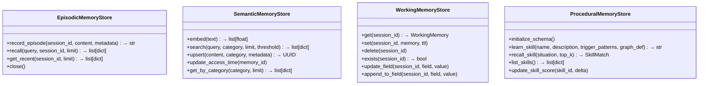
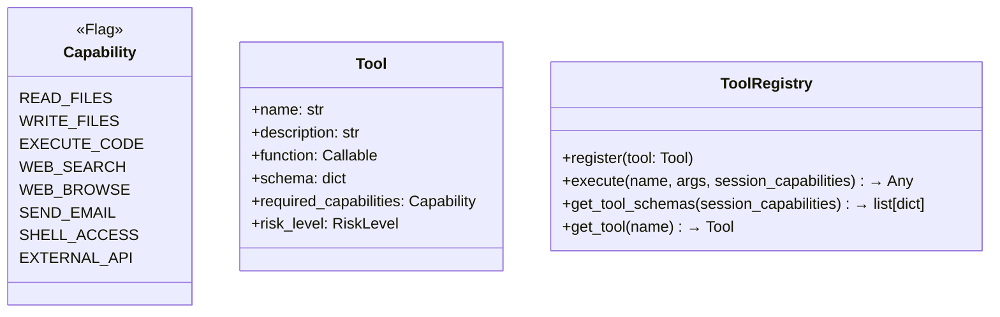
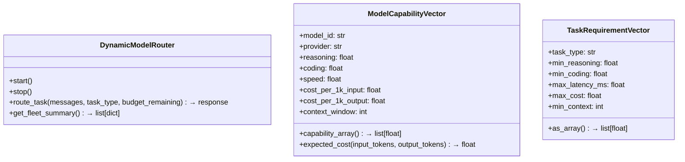
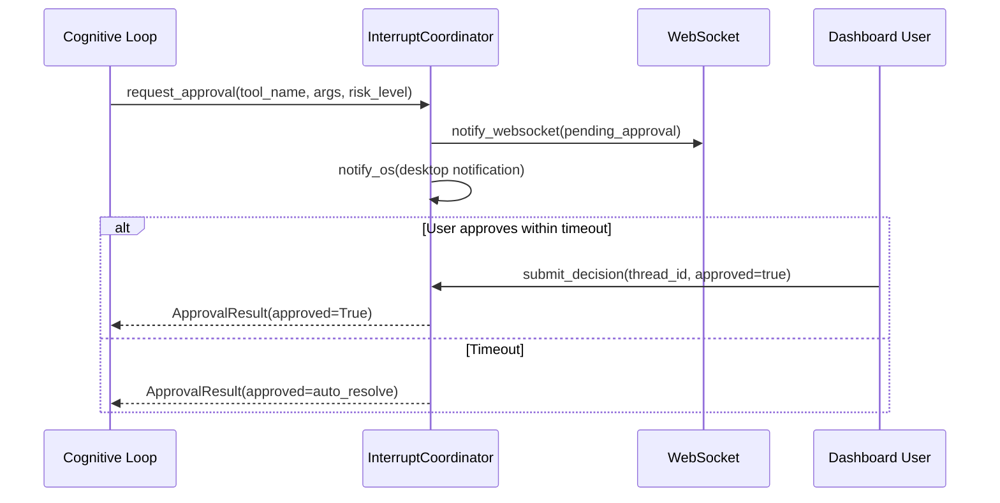
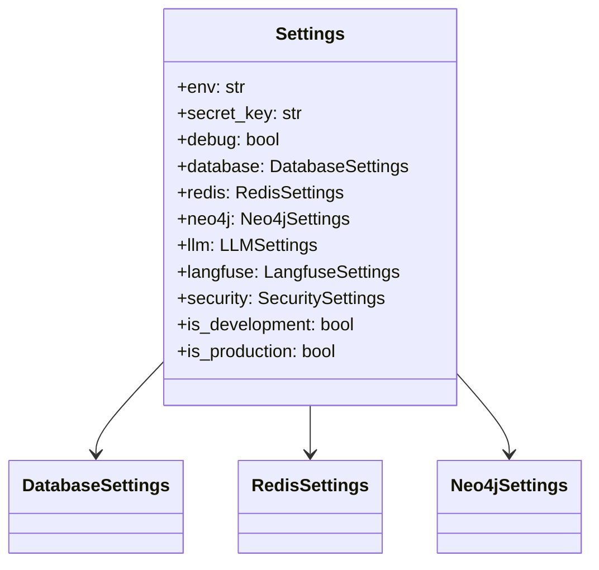

# SuperNova — Interfaces & APIs

## HTTP API (FastAPI)

Base URL: `http://localhost:8000/api/v1`

### Health
| Method | Path | Description |
|--------|------|-------------|
| GET | `/healthz` | Liveness/readiness with backend checks (Postgres, Redis, Neo4j) |

### Agent
| Method | Path | Description |
|--------|------|-------------|
| POST | `/agent/message` | Send message to agent (new or existing session) |

**Request body** (`AgentMessageRequest`):
```json
{
  "message": "string",
  "session_id": "string (optional)",
  "thread_id": "string (optional)"
}
```

### Dashboard
| Method | Path | Description |
|--------|------|-------------|
| GET | `/dashboard/snapshot` | Full dashboard state (agents, memory, approvals, MCP, costs, health) |
| POST | `/dashboard/approvals/{approval_id}/resolve` | Approve/deny pending tool execution |

### Onboarding
| Method | Path | Description |
|--------|------|-------------|
| GET | `/onboarding/status` | First-run detection, setup state |
| POST | `/onboarding/validate-key` | Validate LLM provider API key |
| GET | `/onboarding/cost-estimate` | Monthly cost projections per model |
| POST | `/onboarding/complete` | Finalize setup configuration |

### MCP
| Method | Path | Description |
|--------|------|-------------|
| GET | `/mcp/servers` | List MCP server status |
| GET | `/mcp/tools` | List available MCP tools |
| POST | `/mcp/tools/{name}/call` | Execute MCP tool |
| GET | `/mcp/skills` | List loaded skills |

### Authentication
| Method | Path | Description |
|--------|------|-------------|
| POST | `/auth/token` | Generate JWT access token |

**JWT flow**: `create_access_token(data)` → `verify_token(token)` → `get_current_user(token)`

### WebSocket
| Path | Description |
|------|-------------|
| `ws://localhost:8000/ws/{session_id}` | Real-time agent event stream |

Events: `agent_status`, `tool_execution`, `approval_request`, `memory_update`, `health_alert`

---

## Internal Python Interfaces

### Memory Stores



### Tool Registry



### Model Router



### Interrupt Coordinator



### Configuration



Access via: `from supernova.config import get_settings; settings = get_settings()`
