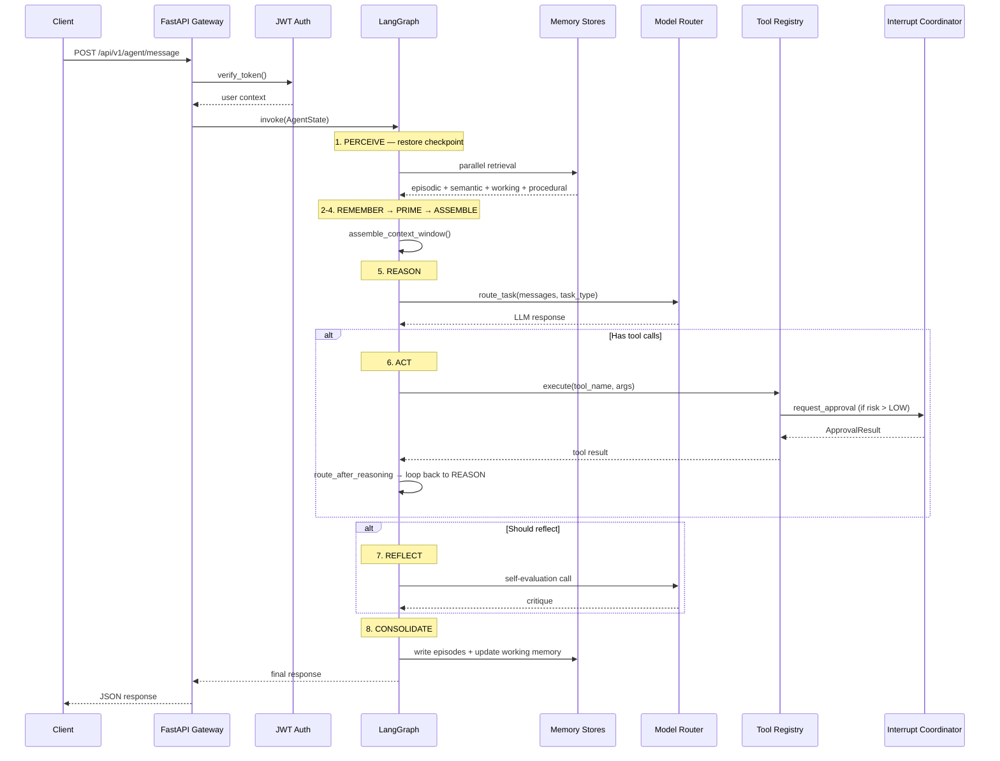
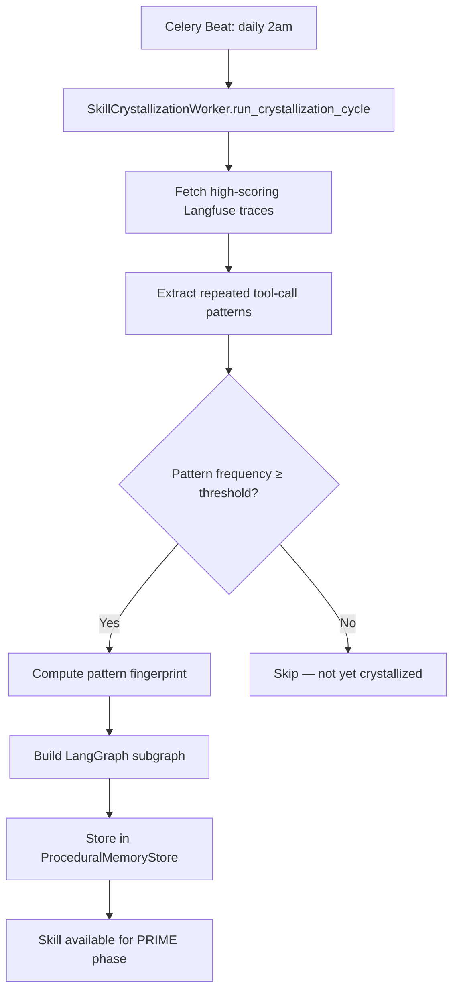
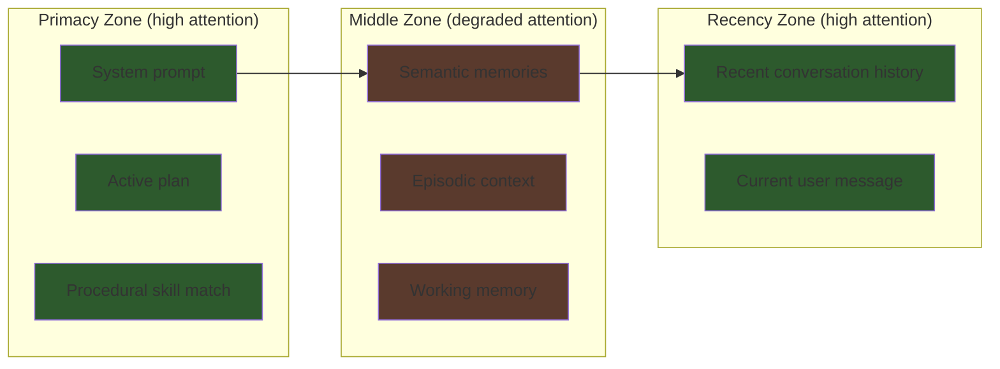
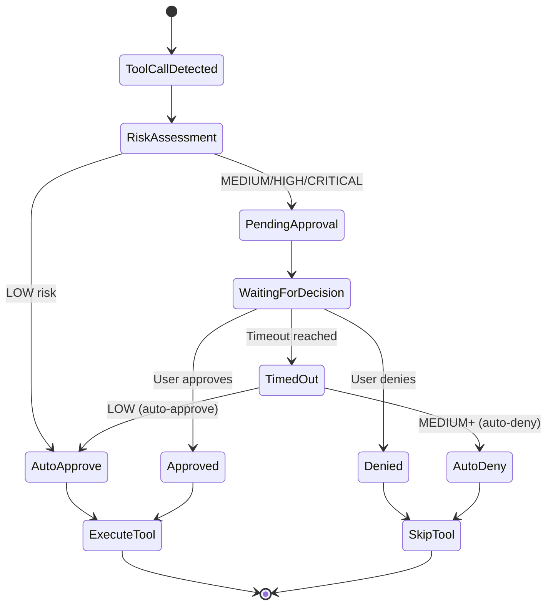
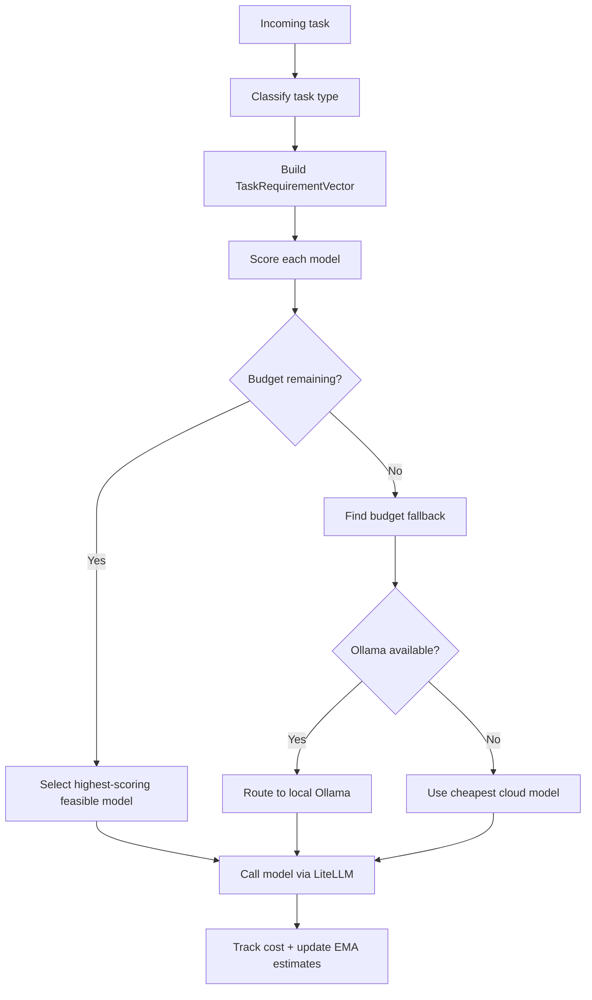
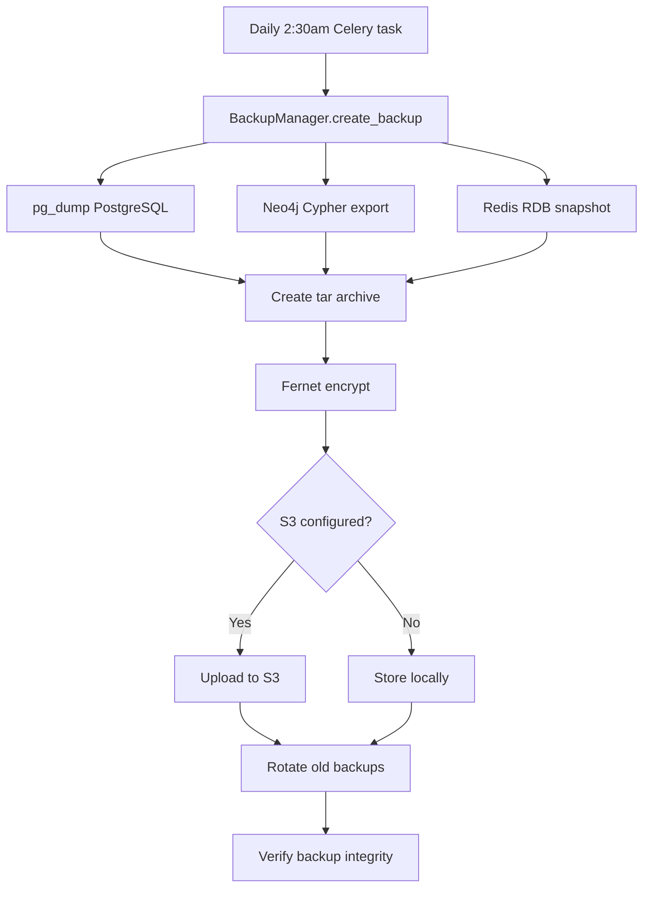

# SuperNova — Key Workflows

## 1. Agent Message Processing



## 2. Skill Crystallization (Daily Worker)



## 3. Context Window Assembly



Token budget is allocated across zones. Important content placed in primacy/recency zones where transformer attention is strongest.

## 4. HITL Approval Flow



## 5. Model Routing Decision



## 6. Background Worker Schedule

```mermaid
gantt
    title Celery Beat Schedule (UTC)
    dateFormat HH:mm
    axisFormat %H:%M
    
    section Every 5min
    MCP Health Check    :active, 00:00, 5m
    
    section Every 15min
    Heartbeat           :active, 00:00, 15m
    
    section Hourly
    Memory Consolidation :crit, 00:00, 60m
    
    section Daily
    Skill Crystallization :02:00, 30m
    Encrypted Backup      :02:30, 30m
    
    section Weekly
    Forgetting Curves     :03:00, 60m
```



## 7. Backup & Recovery



## 8. Dashboard Data Flow

```mermaid
flowchart LR
    subgraph Backend
        API[FastAPI /dashboard/snapshot]
        WS[WebSocket /ws/{session}]
    end
    
    subgraph Dashboard
        Hook[useNovaRealtime hook]
        State[React State]
        Cards[Card Components]
        Charts[Chart Components]
        ThreeD[3D Visualization]
    end
    
    API -->|HTTP poll 3s| Hook
    WS -->|Real-time events| Hook
    Hook --> State
    State --> Cards
    State --> Charts
    State --> ThreeD
```
