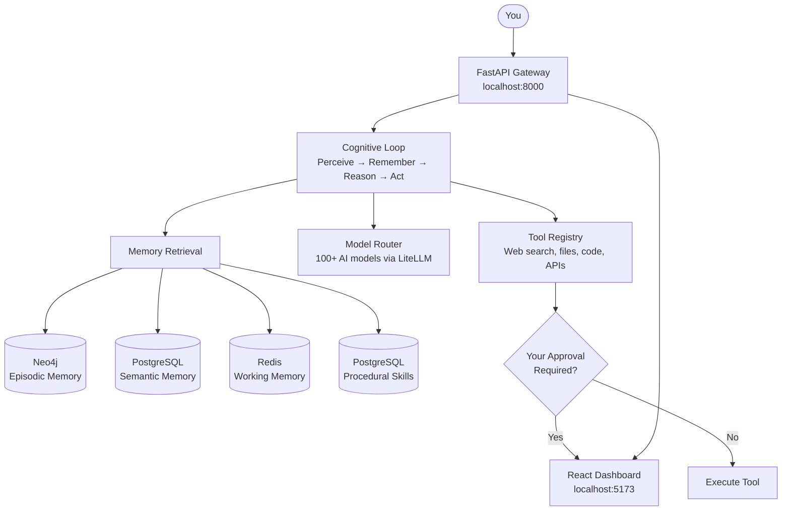

# 🌟 SuperNova

**Your personal AI agent that remembers, learns, and gets better over time.**

SuperNova is an AI assistant you run on your own computer. Unlike cloud-based chatbots, SuperNova keeps all your data private, remembers past conversations, learns from experience, and can use tools (search the web, read/write files, run code) — with your approval for anything risky.

---

## What Can SuperNova Do?

| Capability | What It Means |
|------------|---------------|
| 💬 Conversational AI | Chat naturally — ask questions, get help with tasks, brainstorm ideas |
| 🧠 Persistent Memory | Remembers facts, past conversations, and context across sessions |
| 🔧 Tool Use | Searches the web, reads/writes files, executes code, calls APIs |
| 🛡️ Safety Controls | Asks your permission before doing anything risky (sending emails, deleting files, etc.) |
| 📈 Self-Improvement | Learns shortcuts from repeated tasks and gets faster over time |
| 🔌 Plugin System (MCP) | Connect external tools and services via the Model Context Protocol |
| 📊 Live Dashboard | Monitor the agent's activity, memory, and costs in a 3D visual interface |
| 🔍 Full Observability | Every AI call and tool action is logged and traceable in Langfuse |

---

## How Memory Works

SuperNova has four memory systems, inspired by how human memory works:

| Memory Type | What It Stores | Example |
|-------------|---------------|---------|
| **Working** | Current conversation context | "The user is asking about Python decorators right now" |
| **Semantic** | Long-term facts and knowledge | "The user prefers dark mode and uses VS Code" |
| **Episodic** | Timeline of past interactions | "Last Tuesday, we debugged a database connection issue" |
| **Procedural** | Learned skills and shortcuts | "When asked to deploy, run these 5 steps in order" |

Memories persist across restarts. If the process crashes, it resumes exactly where it left off.

---

## Requirements

Before you start, make sure you have these installed on your computer:

| Software | Minimum Version | What It's For | How to Check |
|----------|----------------|---------------|--------------|
| **Python** | 3.12+ | Runs the AI agent | `python3 --version` |
| **Docker** | 20+ | Runs the databases and services | `docker --version` |
| **Docker Compose** | 2.0+ | Orchestrates multiple services | `docker compose version` |
| **Node.js** | 18+ | Runs the dashboard (optional) | `node --version` |
| **Git** | Any | Downloads the project | `git --version` |

### Installing Prerequisites

If you don't have these installed:

- **Python 3.12+**: Download from [python.org](https://www.python.org/downloads/) or use your system package manager
- **Docker Desktop**: Download from [docker.com](https://www.docker.com/products/docker-desktop/) — this includes Docker Compose
- **Node.js**: Download from [nodejs.org](https://nodejs.org/) (LTS version recommended)
- **Git**: Download from [git-scm.com](https://git-scm.com/downloads)

---

## Installation (Step by Step)

### Step 1: Download the Project

Open a terminal (Command Prompt on Windows, Terminal on Mac/Linux) and run:

```bash
git clone <repository-url>
cd SuperNova
```

### Step 2: Run the Setup Script

```bash
./setup.sh
```

This script automatically:
- ✅ Checks that Python, Docker, and other tools are installed
- ✅ Creates the `workspace/` directory (where the agent stores files)
- ✅ Copies `.env.example` to `.env` (your configuration file)
- ✅ Starts the database services (PostgreSQL, Redis, Neo4j, Langfuse)
- ✅ Installs Python dependencies

> **Windows users**: If `./setup.sh` doesn't work, follow the manual steps below instead.

### Step 3: Add Your AI Provider Key

Open the `.env` file in any text editor and add at least one AI provider key:

```bash
# Pick ONE (or more) of these — uncomment and add your key:
OPENAI_API_KEY=sk-your-key-here
# ANTHROPIC_API_KEY=sk-ant-your-key-here
# GEMINI_API_KEY=your-key-here
```

**Where to get API keys:**
- OpenAI: [platform.openai.com/api-keys](https://platform.openai.com/api-keys)
- Anthropic: [console.anthropic.com/settings/keys](https://console.anthropic.com/settings/keys)
- Google Gemini: [aistudio.google.com/app/apikey](https://aistudio.google.com/app/apikey)

Also generate a secret key for encryption:

```bash
# Run this in your terminal, then paste the output into .env as SUPERNOVA_SECRET_KEY
openssl rand -hex 32
```

### Step 4: Start the Database Services

```bash
docker compose up -d
```

This starts four background services:

| Service | Port | Purpose |
|---------|------|---------|
| **PostgreSQL** | 5432 | Stores semantic memories, skills, and checkpoints |
| **Redis** | 6379 | Fast working memory and task queue |
| **Neo4j** | 7474 / 7687 | Stores episodic memory (timeline of events) |
| **Langfuse** | 3000 | Observability dashboard for tracing AI calls |

Verify everything is running:

```bash
docker compose ps
```

You should see all four services with status "healthy" or "Up".

### Step 5: Set Up the Database Tables

```bash
cd supernova
alembic upgrade head
```

This creates the tables SuperNova needs to store memories and state. You only need to run this once (or after updates that include new migrations).

### Step 6: Start the Agent

You need three terminal windows:

**Terminal 1 — API Server** (the main agent):
```bash
cd supernova
uvicorn api.gateway:app --reload --log-level debug
```

**Terminal 2 — Background Worker** (handles async tasks):
```bash
cd supernova
celery -A workers worker --loglevel=debug
```

**Terminal 3 — Task Scheduler** (runs periodic maintenance):
```bash
cd supernova
celery -A workers beat --loglevel=debug --scheduler=redbeat.RedBeatScheduler
```

The agent is now running at **http://localhost:8000**.

### Step 7: Start the Dashboard (Optional)

```bash
cd dashboard
npm install
npm run dev
```

Open **http://localhost:5173** in your browser to see the 3D monitoring dashboard.

---

## Manual Setup (If setup.sh Doesn't Work)

If the automated script fails (e.g., on Windows), follow these steps manually:

```bash
# 1. Create workspace directory
mkdir -p workspace

# 2. Copy environment config
cp .env.example .env

# 3. Install uv (fast Python package manager)
curl -LsSf https://astral.sh/uv/install.sh | sh

# 4. Install Python dependencies
cd supernova
uv sync --all-extras
# Or with pip: pip install -e ".[dev]"

# 5. Start infrastructure
cd ..
docker compose up -d

# 6. Run database migrations
cd supernova
alembic upgrade head
```

---

## Using SuperNova

### Talking to the Agent

Send a message to the agent via the API:

```bash
curl -X POST http://localhost:8000/api/v1/agent/message \
  -H "Content-Type: application/json" \
  -d '{"message": "Hello! What can you help me with?"}'
```

Or connect via WebSocket for real-time streaming:

```
ws://localhost:8000/agent/stream/{session_id}?token=YOUR_TOKEN
```

### The Dashboard

The dashboard at **http://localhost:5173** shows:

- **Agent Status** — Is the agent running? What's it doing right now?
- **Memory Visualization** — 3D view of the agent's knowledge graph
- **Approval Queue** — Pending tool actions that need your OK
- **Cost Tracking** — How much you're spending on AI API calls
- **MCP Servers** — Connected external tools and their status
- **Skills** — Learned procedures the agent has crystallized

### Approving Tool Actions

When the agent wants to do something potentially risky (write a file, send an email, execute code), it pauses and asks for your approval. You can approve or deny from:

- The dashboard UI (Approvals panel)
- The API: `POST /api/v1/dashboard/approvals/{id}/resolve`

Risk levels and what happens if you don't respond:

| Risk Level | Examples | Timeout | If No Response |
|------------|----------|---------|----------------|
| Low | Web search, read files | 30 seconds | Auto-approved |
| Medium | Write files, run code | 2 minutes | Auto-denied |
| High | Send email, call external API | 5 minutes | Auto-denied |
| Critical | Delete database, make payment | 10 minutes | Auto-denied |

---

## Configuration Guide

All settings are in the `.env` file. Here are the most important ones:

### Required Settings

| Variable | Description | Example |
|----------|-------------|---------|
| `OPENAI_API_KEY` | Your OpenAI API key (or another provider) | `sk-abc123...` |
| `SUPERNOVA_SECRET_KEY` | Encryption key (generate with `openssl rand -hex 32`) | `a1b2c3d4...` |

### Optional but Recommended

| Variable | Description | Default |
|----------|-------------|---------|
| `SUPERNOVA_ENV` | Environment mode | `development` |
| `LITELLM_DEFAULT_MODEL` | Which AI model to use | `gpt-4o-mini` |
| `LITELLM_FALLBACK_MODELS` | Backup models if primary fails | `gpt-3.5-turbo,claude-3-haiku-20240307` |
| `COST_BUDGET_DAILY_USD` | Daily spending limit on AI calls | `10.00` |
| `COST_BUDGET_MONTHLY_USD` | Monthly spending limit | `100.00` |

### Feature Flags

Turn features on or off:

| Variable | What It Controls | Default |
|----------|-----------------|---------|
| `FEATURE_SKILL_CRYSTALLIZATION` | Agent learns shortcuts from repeated tasks | `true` |
| `FEATURE_EPISODIC_MEMORY` | Agent remembers past conversations | `true` |
| `FEATURE_SEMANTIC_MEMORY` | Agent stores long-term facts | `true` |
| `FEATURE_HITL_INTERRUPTS` | Agent asks permission for risky actions | `true` |
| `FEATURE_DEMO_MODE` | Run without API keys (limited functionality) | `false` |

See `.env.example` for the complete list of 70+ configuration options with descriptions.

---

## API Reference

### Core Endpoints

| Method | URL | Description |
|--------|-----|-------------|
| `GET` | `/health` | Quick health check — returns `{"status": "ok"}` |
| `GET` | `/health/deep` | Detailed health check of all backend services |
| `GET` | `/metrics` | Prometheus-format performance metrics |
| `POST` | `/auth/token` | Get an authentication token |

### Agent

| Method | URL | Description |
|--------|-----|-------------|
| `POST` | `/api/v1/agent/message` | Send a message to the agent |
| `WS` | `/agent/stream/{session_id}` | Real-time streaming via WebSocket |

### Memory

| Method | URL | Description |
|--------|-----|-------------|
| `GET` | `/memory/semantic` | Browse stored facts and knowledge |
| `GET` | `/memory/procedural` | View learned skills |
| `GET` | `/memory/export` | Export all memories as JSON |
| `POST` | `/memory/import` | Import memories from JSON |

### Dashboard & Admin

| Method | URL | Description |
|--------|-----|-------------|
| `GET` | `/api/v1/dashboard/snapshot` | Full dashboard state |
| `POST` | `/api/v1/dashboard/approvals/{id}/resolve` | Approve or deny a tool action |
| `GET` | `/admin/fleet` | Model router status and fleet summary |
| `GET` | `/admin/costs` | AI API cost breakdown |
| `GET` | `/admin/audit-logs` | Security audit trail |

### MCP & Skills

| Method | URL | Description |
|--------|-----|-------------|
| `GET` | `/api/v1/mcp/servers` | List connected MCP servers |
| `GET` | `/api/v1/mcp/tools` | List available external tools |
| `POST` | `/api/v1/mcp/tools/{name}` | Execute an MCP tool |
| `GET` | `/api/v1/skills` | List learned skills |
| `POST` | `/api/v1/skills/{name}/activate` | Enable a skill |
| `POST` | `/api/v1/skills/{name}/deactivate` | Disable a skill |

### Onboarding

| Method | URL | Description |
|--------|-----|-------------|
| `GET` | `/api/v1/onboarding/status` | Check setup progress |
| `POST` | `/api/v1/onboarding/validate-key` | Test if an API key works |
| `GET` | `/api/v1/onboarding/cost-estimate` | Estimate monthly costs |
| `POST` | `/api/v1/onboarding/complete` | Finish initial setup |

---

## Architecture Overview



### How the Agent Thinks (Cognitive Cycle)

Each time you send a message, the agent goes through these steps:

1. **Perceive** — Receives your message and restores its state from the last checkpoint
2. **Remember** — Searches all four memory systems for relevant context
3. **Prime** — Checks if it has a learned skill that matches your request
4. **Assemble** — Builds an optimized prompt with the most relevant context
5. **Reason** — Sends the prompt to the AI model and gets a response
6. **Act** — Executes any tool calls (with your approval if risky)
7. **Reflect** — Optionally evaluates the quality of its own response
8. **Consolidate** — Saves new memories and updates its knowledge

---

## Infrastructure Services

SuperNova runs four background services via Docker:

| Service | Image | Port | What It Does |
|---------|-------|------|-------------|
| PostgreSQL | `pgvector/pgvector:pg16` | 5432 | Stores semantic memories, procedural skills, agent checkpoints. Includes pgvector for AI embeddings. |
| Redis | `redis:7-alpine` | 6379 | Fast working memory, task queue for background workers, embedding cache. |
| Neo4j | `neo4j:5-community` | 7474 (web), 7687 (bolt) | Temporal knowledge graph for episodic memory — tracks what happened and when. |
| Langfuse | `langfuse/langfuse:2` | 3000 | Observability platform — traces every AI call, tool execution, and cost. Open http://localhost:3000 to view. |

### Managing Services

```bash
# Start all services
docker compose up -d

# Check status
docker compose ps

# View logs for a specific service
docker compose logs -f postgres
docker compose logs -f redis

# Stop all services (keeps data)
docker compose down

# Stop and DELETE all data (fresh start)
docker compose down -v

# Restart a single service
docker compose restart neo4j
```

---

## Troubleshooting

### "Port already in use" Error

Another process is using a port SuperNova needs.

```bash
# Find what's using the port (example: port 5432)
sudo lsof -i :5432
# Or on Linux:
ss -tlnp | grep 5432

# Remove old SuperNova containers that might be lingering
docker ps -a --filter "name=supernova" --format '{{.ID}}' | xargs -r docker rm -f

# Then try again
docker compose up -d
```

### Alembic Migration Fails with "DuplicateTableError"

This happens because Langfuse and SuperNova share the same PostgreSQL database. If you see an error about `audit_logs` already existing, make sure you have the latest code (commit `c0b2f00` or later) which renamed the table to `supernova_audit_logs`.

```bash
# Reset and re-run migrations
cd supernova
docker compose down -v   # WARNING: deletes all data
docker compose up -d
sleep 15                  # Wait for services to be healthy
alembic upgrade head
```

### Docker Services Won't Start

```bash
# Check if Docker is running
docker info

# Check for errors in service logs
docker compose logs

# Nuclear option: remove everything and start fresh
docker compose down -v
docker compose up -d
```

### "Connection Refused" Errors

The services might not be fully started yet. Wait 15–20 seconds after `docker compose up -d`, then check:

```bash
# Verify all services are healthy
docker compose ps

# Test PostgreSQL
docker exec supernova-postgres-1 psql -U supernova -d supernova -c "SELECT 1;"

# Test Redis
docker exec supernova-redis-1 redis-cli ping

# Test Neo4j
docker exec supernova-neo4j-1 cypher-shell -u neo4j -p supernova_neo4j_dev "RETURN 1;"

# Test Langfuse
curl http://localhost:3000/api/public/health
```

### Agent Crashes or Hangs

SuperNova is durable — it checkpoints its state to PostgreSQL. Just restart:

```bash
# Restart the API server (Terminal 1)
# Press Ctrl+C, then:
uvicorn api.gateway:app --reload --log-level debug
```

The agent will resume from its last checkpoint automatically.

---

## Project Structure

```
SuperNova/
├── README.md                   # ← You are here
├── docker-compose.yml          # Infrastructure services configuration
├── setup.sh                    # Automated setup script
├── .env.example                # Configuration template (70+ options)
├── .env                        # Your local configuration (not in git)
│
├── loop.py                     # Core cognitive loop
├── context_assembly.py         # Context window optimization
├── procedural.py               # Skill learning and storage
├── dynamic_router.py           # AI model selection and routing
├── interrupts.py               # Human approval workflow
│
├── supernova/                  # Main Python package
│   ├── config.py               # Settings loader
│   ├── api/                    # Web API endpoints
│   │   ├── gateway.py          # Main API server
│   │   ├── auth.py             # Authentication (JWT)
│   │   ├── websockets.py       # Real-time streaming
│   │   └── routes/             # API route handlers
│   ├── core/
│   │   ├── memory/             # Memory system implementations
│   │   └── backup/             # Backup and recovery
│   ├── infrastructure/
│   │   ├── llm/                # AI model cost tracking
│   │   ├── security/           # Encryption, audit logging
│   │   ├── observability/      # Logging, health checks, metrics
│   │   ├── storage/            # Database connections
│   │   └── tools/              # Built-in tools (web search, files, code)
│   ├── mcp/                    # External tool integration (MCP)
│   ├── skills/                 # Learned skill loader
│   ├── workers/                # Background task processors
│   ├── alembic/                # Database migration scripts
│   └── tests/                  # Test suite (27 files, 84%+ coverage)
│
├── dashboard/                  # React 19 monitoring UI
│   ├── src/                    # Dashboard source code
│   └── tests/                  # Frontend tests
│
├── workspace/                  # Agent's file sandbox (jailed access)
├── logs/                       # Application logs
│
├── AGENTS.md                   # Detailed technical reference
├── CONTRIBUTING.md             # How to contribute
├── DEPLOYMENT.conf             # Production deployment guide
├── PROGRESS_TRACKER.md         # Build progress (16 phases)
└── SYSTEM_RELATION_GRAPH.md    # Architecture diagrams
```

---

## Testing

### Run Backend Tests

```bash
cd supernova
pytest tests/ -v --cov=. --cov-report=term-missing
```

Current coverage: **84%+** across 391 tests.

### Run Dashboard Tests

```bash
cd dashboard
npm run test:unit     # Unit tests (Vitest)
npm run test:e2e      # End-to-end tests (Playwright)
```

---

## Further Documentation

| Document | Who It's For | What's Inside |
|----------|-------------|---------------|
| [AGENTS.md](AGENTS.md) | Developers / AI agents | Complete technical reference — every module, function, and config option |
| [CONTRIBUTING.md](CONTRIBUTING.md) | Contributors | Code style, testing requirements, PR process |
| [DEPLOYMENT.conf](DEPLOYMENT.conf) | DevOps / Sysadmins | Production deployment with systemd, Docker, and Nginx |
| [PROGRESS_TRACKER.md](PROGRESS_TRACKER.md) | Project managers | 16-phase build specification and status |
| [SYSTEM_RELATION_GRAPH.md](SYSTEM_RELATION_GRAPH.md) | Architects | System architecture with Mermaid diagrams |
| `.env.example` | Everyone | All 70+ configuration options with descriptions |

---

## License

MIT — free to use, modify, and distribute.
