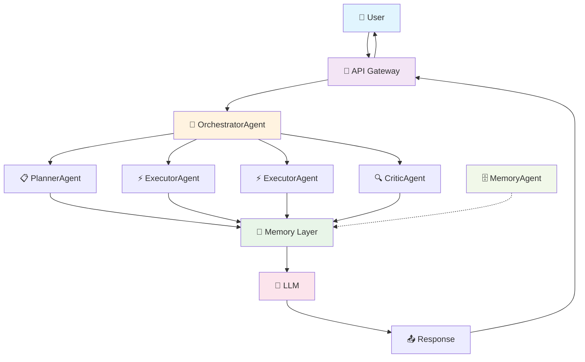

# 🌟 SuperNova

**The AI assistant you can inspect and trust.**

SuperNova runs entirely on your machine — your conversations, memories, and data never leave your computer. Every action requires your approval. Every decision is logged and auditable. Every piece of memory is inspectable through a 3D visualization. This isn't another cloud AI that you have to trust blindly; it's an AI you can verify, control, and truly own.

## Architecture



---

## How SuperNova Compares

| Feature | SuperNova | MemGPT | Open Interpreter | ChatGPT |
|---------|-----------|---------|------------------|---------|
| **Privacy (Local-First)** | ✅ Fully local | ✅ Local option | ✅ Local option | ❌ Cloud only |
| **Persistent Memory** | ✅ 4 memory types | ✅ Advanced memory | ❌ Session only | ❌ Session only |
| **Approval System** | ✅ Granular control | ❌ No approval | ❌ No approval | ❌ No approval |
| **Local Models** | ✅ Full support | ✅ Full support | ✅ Full support | ❌ OpenAI only |
| **Cost** | 💰 Pay per use | 💰 Pay per use | 💰 Pay per use | 💰💰 Subscription |
| **Open Source** | ✅ MIT License | ✅ Apache 2.0 | ✅ MIT License | ❌ Proprietary |
| **Setup Complexity** | ⚠️ High (Docker + deps) | ⚠️ Medium | ✅ Low (pip install) | ✅ None (web) |
| **Maturity** | ⚠️ Pre-alpha | ✅ Stable | ✅ Stable | ✅ Production |
| **Memory Visualization** | ✅ 3D interactive | ❌ Text only | ❌ None | ❌ None |
| **Multi-Agent System** | ✅ Orchestrated agents | ❌ Single agent | ❌ Single agent | ❌ Single model |

**Honest assessment:** SuperNova is the most transparent and controllable, but requires significant setup and is still in early development. Choose MemGPT for mature local memory, Open Interpreter for simplicity, or ChatGPT for zero-setup convenience.

---

## What Does It Do?

| Feature | What It Means For You |
|---------|----------------------|
| 🧠 **Remembers Everything** | Tell it something once, and it remembers it for next time |
| 💬 **Natural Chat** | Just type and press Enter — like texting a friend |
| 🔍 **Searches the Web** | It can look up information when you need it |
| 📁 **Handles Files** | Read, write, and organize your files — with your permission |
| 🛡️ **Safe by Default** | It asks before doing anything risky |
| 📊 **See What It Knows** | Beautiful 3D view of everything it remembers about you |
| 💰 **Tracks Costs** | You see exactly how much you're spending on AI |

---

## What Does It Look Like?

When you open SuperNova, you'll see:

```
┌─────────────────────────────────────────────────────────────┐
│  🌟 SuperNova                              [Agent: Active]  │
├─────────────────────────────────────────────────────────────┤
│  ┌─────────┐ ┌─────────┐ ┌─────────┐ ┌─────────┐ ┌───────┐ │
│  │Overview│ │ Agents  │ │ Memory  │ │Decisions│ │  MCP  │ │
│  └─────────┘ └─────────┘ └─────────┘ └─────────┘ └───────┘ │
├─────────────────────────────────────────────────────────────┤
│                                                             │
│     ┌─────────────────────────────────────────────────┐     │
│     │         [3D Memory Visualization]              │     │
│     │                                                  │     │
│     │         ✦ ───── ✦                              │     │
│     │        /         \                              │     │
│     │       ✦  Facts   ✦ ─── ✦ Skills               │     │
│     │        \         /                              │     │
│     │         ✦ ───── ✦                              │     │
│     │              │                                  │     │
│     │         ✦ Episodes                             │     │
│     │                                                  │     │
│     └─────────────────────────────────────────────────┘     │
│                                                             │
│     ┌─────────────────────────────────────────────────┐     │
│     │  💬 Chat                                        │     │
│     │  ─────────────────────────────────────────────  │     │
│     │                                                 │     │
│     │  You: What's my favorite color?                │     │
│     │                                                 │     │
│     │  SuperNova: From our conversations, you       │     │
│     │  mentioned you love blue — especially         │     │
│     │  deep ocean blue. You said it reminds         │     │
│     │  you of your trips to Hawaii.                 │     │
│     │                                                 │     │
│     │  ─────────────────────────────────────────────  │     │
│     │  [ Type your message...                    ]  │     │
│     └─────────────────────────────────────────────────┘     │
│                                                             │
└─────────────────────────────────────────────────────────────┘
```

**The main things you'll do:**
1. **Type messages** in the chat box at the bottom
2. **Click Approve or Deny** when the agent wants to do something
3. **Explore** the pretty memory visualization (optional)

---

## How It Works

### The Approval System

When SuperNova wants to do something potentially risky, it stops and asks:

```
┌─────────────────────────────────────────────────────────────┐
│  ⚠️ Approval Request                                       │
│                                                             │
│  Tool: send_email                                          │
│  To: boss@company.com                                       │
│  Subject: Project Update                                    │
│                                                             │
│  Risk Level: HIGH                                          │
│                                                             │
│  ┌─────────────────┐    ┌─────────────────┐                │
│  │   ✓ APPROVE    │    │   ✗ DENY       │                │
│  └─────────────────┘    └─────────────────┘                │
│                                                             │
│  Auto-resolves in: 4:32                                    │
└─────────────────────────────────────────────────────────────┘
```

**What happens if you don't respond?**

| Action Type | Examples | What Happens |
|-------------|----------|--------------|
| 🟢 Safe | Search web, read files | Auto-approves after 30 seconds |
| 🟡 Moderate | Write files, run code | Waits 2 minutes, then denies |
| 🔴 Risky | Send email, call APIs | Waits 5 minutes, then denies |
| ⛔ Critical | Delete data, payments | Waits 10 minutes, then denies |

---

### How It Remembers

SuperNova has four types of memory (inspired by how human brains work):

1. **Working Memory** — What you're currently discussing
   > "The user is asking about vacation ideas right now"

2. **Semantic Memory** — Facts about you
   > "User prefers dark mode, uses VS Code, allergic to nuts"

3. **Episodic Memory** — Past conversations
   > "Last Tuesday we planned a birthday party for Sarah"

4. **Procedural Memory** — Learned skills
   > "When user asks to deploy, first check git status, then run tests..."

**You can actually see this!** Click the **Memory** tab to see a 3D visualization of everything SuperNova knows about you.

---

## Quick Start (5 Minutes)

### 1. Install

Download and run the setup:

```bash
git clone <repository-url>
cd SuperNova
./setup.sh
```

> **Windows?** Double-click `setup.bat` instead of running the shell script.

### 2. Add Your AI Key

Open the `.env` file and add one API key:

```
OPENAI_API_KEY=sk-your-key-here
```

[Get a free key from OpenAI](https://platform.openai.com/api-keys)

### 3. Start It Up

```bash
docker compose up -d
cd supernova
uvicorn api.gateway:app --reload
```

### 4. Open the Dashboard

```bash
cd dashboard
npm install
npm run dev
```

Then open **http://localhost:5173** in your browser.

### 5. Start Chatting!

That's it! Type in the chat box and press Enter.

---

## Daily Use

### Talking to SuperNova

Just open the dashboard and type:

```
You: What's my favorite programming language?
```

It will search its memory and respond with something like:

```
SuperNova: From our chats, you mentioned Python is your favorite.
You called it "the perfect blend of power and readability."
```

### Approving Requests

When SuperNova needs to do something, a card pops up:

```
┌──────────────────────────────────────────┐
│ 🔧 Wants to write a file                  │
│                                           │
│   workspace/notes.txt                     │
│                                           │
│   Preview: "Meeting notes for today..."   │
│                                           │
│   [✓ Approve]  [✗ Deny]                   │
└──────────────────────────────────────────┘
```

Click **Approve** or **Deny**. That's it.

### Viewing Memory

Click the **Memory** tab to see a 3D visualization:

- **Floating nodes** = memories
- **Colors** = different types (facts, conversations, skills)
- **Lines** = connections between related memories
- **Click** any node to see details
- **Drag** to rotate the view
- **Scroll** to zoom in/out

It's actually useful — you can verify what SuperNova knows about you and spot any misunderstandings.

---

## Checking Costs

Click the **Overview** tab. You'll see a **Cost Widget** showing:

- Today's spending
- Monthly budget vs. actual
- Which AI model is being used

SuperNova automatically picks cheaper AI models for simple tasks to save you money.

---

## Troubleshooting

### "I can't connect"

Make sure Docker is running:
```bash
docker compose ps
```

You should see all services as "healthy". If not:
```bash
docker compose restart
```

### "The dashboard won't open"

Make sure you're using the right URL: **http://localhost:5173** (not http://127.0.0.1)

### "It's not responding to my messages"

Check the API is running:
```bash
curl http://localhost:8000/health
```

Should return `{"status": "ok"}`

### "It forgot everything I told it"

Check the database services are running:
```bash
docker compose ps
```

If PostgreSQL or Redis stopped, restart them:
```bash
docker compose restart
```

---

## Settings You'll Want to Change

Open the `.env` file in any text editor:

| Setting | What It Does | Default |
|---------|-------------|---------|
| `OPENAI_API_KEY` | Your AI API key | (required) |
| `COST_BUDGET_DAILY_USD` | Max to spend per day | $10.00 |
| `COST_BUDGET_MONTHLY_USD` | Max to spend per month | $100.00 |
| `LITELLM_DEFAULT_MODEL` | Which AI to use | gpt-4o-mini |

That's it! The defaults work fine for most people.

### Control Panel (Dashboard Settings)

SuperNova includes a visual **Settings** tab in the dashboard where you can control:

| Setting | What It Does |
|---------|-------------|
| **Risk Control** | Choose when SuperNova asks for approval (Always, Risky only, Never) |
| **Speed Control** | Balance between fast responses and thorough reasoning |
| **Budget** | Set your daily spending limit |
| **Tool Access** | Enable/disable specific capabilities (web search, file operations, code execution) |
| **Self-Reflection** | Enable agent to evaluate its own responses |
| **Query Caching** | Skip AI for repeated queries |

**Quick Presets:**
- 🔒 **Maximum** — Approves everything, full control
- ⚠️ **Careful** — Approve risky actions only
- ⚖️ **Balanced** — Recommended default
- 🚀 **Fast** — Let it run autonomously

Access Settings at: **http://localhost:5173** → Click Settings tab

---

## Terminal UI

Prefer working in the terminal? SuperNova has a full-featured TUI:

```bash
cd supernova
python -m tui
```

```
┌──────────────────────────────────────────────────────────────┐
│  ✦ SuperNova — AI Agent                                     │
├──────────────────────────────────────────────────────────────┤
│  💬 Chat  │  🧠 Memory  │  🛡️ Approvals  │  📊 Admin  │  📋 Logs │
├──────────────────────────────────────────────────────────────┤
│                                                              │
│  ✦ Welcome to SuperNova                                     │
│                                                              │
│    Type a message below and press Enter to chat.            │
│    Use Ctrl+1‑5 to switch tabs, Ctrl+P for commands.        │
│                                                              │
│  ──────────────────────────────────────────────────────────  │
│  [ Send a message to SuperNova…                         ]   │
│                                                              │
│  ● Connected  │  Model: gpt-4o-mini  │  Session: a1b2c3d4  │
└──────────────────────────────────────────────────────────────┘
```

**Keyboard shortcuts:**

| Key | Action |
|-----|--------|
| `Ctrl+1‑5` | Switch tabs (Chat, Memory, Approvals, Admin, Logs) |
| `Ctrl+P` | Open command palette |
| `Ctrl+Q` | Quit |
| `Enter` | Send message / Search |

**What each tab does:**

| Tab | What You'll Find |
|-----|-------------------|
| 💬 Chat | Talk to SuperNova, see streaming responses |
| 🧠 Memory | Search what SuperNova remembers, view learned skills |
| 🛡️ Approvals | Approve or deny pending actions |
| 📊 Admin | Health checks, cost tracking, audit logs |
| 📋 Logs | Live TUI event log for troubleshooting |

**Custom API URL:**

```bash
SUPERNOVA_API_URL=http://myserver:8000 python -m tui
```

---

## For Developers

If you're technical and want to use the API directly:

### Send a Message

```bash
curl -X POST http://localhost:8000/api/v1/agent/message \
  -H "Content-Type: application/json" \
  -d '{"message": "Hello!"}'
```

### WebSocket (Real-Time)

```
ws://localhost:8000/agent/stream/{session_id}?token=YOUR_TOKEN
```

### API Reference

| Endpoint | Description |
|----------|-------------|
| `GET /health` | Is it running? |
| `POST /api/v1/agent/message` | Send a message |
| `WS /agent/stream/{id}` | Real-time chat |
| `GET /memory/semantic` | Browse memories |
| `GET /admin/costs` | View spending |
| `GET /api/v1/preferences` | Get user preferences |
| `POST /api/v1/preferences` | Set user preferences |
| `POST /api/v1/preferences/preset/{name}` | Apply a preset (paranoid, careful, balanced, fast) |

---

## What's Running Under the Hood

SuperNova uses four database services (started via Docker):

| Service | What It Does |
|---------|-------------|
| **PostgreSQL** | Stores memories and learned skills |
| **Redis** | Fast temporary storage |
| **Neo4j** | Timeline of past conversations |
| **Langfuse** | Tracks AI performance (optional) |

You don't need to interact with these — SuperNova handles it all.

---

## Project Structure

```
SuperNova/
├── dashboard/          # The web interface you see
├── supernova/          # The main AI system
├── loop.py            # How the agent thinks
├── context_assembly.py # How it builds context
├── interrupts.py      # How approval requests work
├── docker-compose.yml  # Database services
├── .env               # Your settings
└── README.md          # ← You're here
```

---

## Need Help?

- **It's not working** → Check the Troubleshooting section above
- **Want to know more** → See README sections below
- **Found a bug** → Open an issue on GitHub

---

## License

MIT — free to use and modify.
