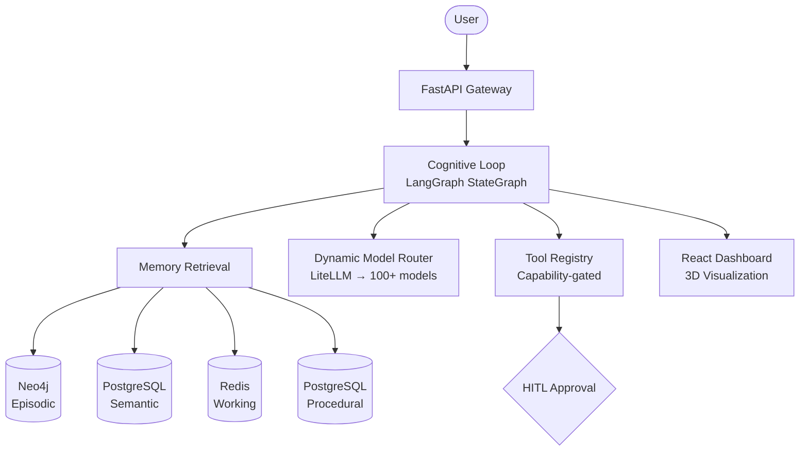

# 🌟 SuperNova

**A production-grade personal AI agent with persistent memory and autonomous cognition.**

SuperNova implements a cognitive architecture inspired by human memory systems — episodic, semantic, procedural, and working memory — orchestrated through a durable LangGraph execution engine with full observability.

## ✨ Key Features

- **Durable Execution** — Process crashes resume from the last checkpoint via PostgreSQL
- **Four Memory Systems** — Episodic (Neo4j), Semantic (pgvector), Procedural (compiled skills), Working (Redis)
- **Self-Improvement** — Automatically crystallizes repeated tool-call patterns into reusable skills
- **Human-in-the-Loop Safety** — Capability-gated tools with risk-based approval workflows
- **Positional Context Optimization** — Assembles context windows following attention topology research
- **Full Observability** — Every LLM call and tool execution traced in Langfuse
- **3D Dashboard** — React 19 monitoring UI with Three.js memory visualization

## 🚀 Quick Start

### Prerequisites

- Python 3.12+
- Docker & Docker Compose
- Node.js 18+ (for dashboard)

### 1. Clone & Setup

```bash
git clone <repository-url>
cd SuperNova
./setup.sh
```

The setup script validates your environment, creates the workspace directory, copies `.env.example` to `.env`, boots Docker infrastructure, and installs Python dependencies.

### 2. Configure Environment

```bash
cp .env.example .env
# Edit .env with your API keys:
#   OPENAI_API_KEY=sk-...
#   SUPERNOVA_SECRET_KEY=$(openssl rand -hex 32)
```

### 3. Start Infrastructure

```bash
docker compose up -d
```

This starts PostgreSQL (with pgvector), Redis, Neo4j, and Langfuse.

### 4. Run Database Migrations

```bash
cd supernova
alembic upgrade head
```

### 5. Start the Agent

```bash
# Terminal 1: API server
cd supernova
uvicorn api.gateway:app --reload --log-level debug

# Terminal 2: Celery worker
cd supernova
celery -A workers worker --loglevel=debug

# Terminal 3: Celery Beat scheduler
cd supernova
celery -A workers beat --loglevel=debug --scheduler=redbeat.RedBeatScheduler
```

### 6. Start the Dashboard

```bash
cd dashboard
npm install
npm run dev
```

Open http://localhost:5173 for the dashboard, http://localhost:8000/healthz for the API health check.

## 🏗️ Architecture



### Cognitive Cycle

1. **PERCEIVE** — Restore state from checkpoint
2. **REMEMBER** — Parallel retrieval from all memory stores
3. **PRIME** — Check for applicable compiled skills
4. **ASSEMBLE** — Build optimally-positioned context window
5. **REASON** — LLM call via dynamic model router
6. **ACT** — Execute tools (with HITL approval for risky operations)
7. **REFLECT** — Optional self-evaluation
8. **CONSOLIDATE** — Write episodes and update working memory

## 📁 Project Structure

```
SuperNova/
├── loop.py                 # Cognitive loop (LangGraph StateGraph)
├── context_assembly.py     # Positional context window assembly
├── procedural.py           # Skill storage & crystallization
├── dynamic_router.py       # Capability-vector model router
├── interrupts.py           # HITL interrupt coordinator
├── supernova/              # Main Python package
│   ├── api/                # FastAPI endpoints
│   ├── core/memory/        # Memory store implementations
│   ├── core/backup/        # Backup & recovery
│   ├── infrastructure/     # Storage, tools, security, observability
│   ├── mcp/                # Model Context Protocol client
│   ├── skills/             # Skill loader with hot-reload
│   ├── workers/            # Celery background tasks
│   └── tests/              # 27 test files
├── dashboard/              # React 19 + Three.js frontend
├── docker-compose.yml      # Infrastructure stack
└── DEPLOYMENT.conf         # Production deployment config
```

## 🧪 Testing

```bash
# Python backend (from supernova/)
pytest tests/ -v --cov=supernova --cov-fail-under=80

# Dashboard
cd dashboard && npm test
```

## 📊 API

| Method | Path | Description |
|--------|------|-------------|
| POST | `/api/v1/agent/message` | Send message to agent |
| GET | `/api/v1/dashboard/snapshot` | Dashboard state |
| POST | `/api/v1/dashboard/approvals/{id}/resolve` | Approve/deny tool execution |
| GET | `/healthz` | Health check |
| WS | `/ws/{session_id}` | Real-time event stream |

See [AGENTS.md](AGENTS.md) for the complete API reference.

## 🔧 Configuration

All configuration is via environment variables. Copy `.env.example` for the full list of 70+ options including:

- LLM provider keys (OpenAI, Anthropic, Google)
- Database connections (PostgreSQL, Redis, Neo4j)
- Security settings (JWT secret, HMAC key, encryption key)
- Observability (Langfuse keys)
- Cost controls and budget limits

## 📚 Documentation

| Document | Purpose |
|----------|---------|
| [AGENTS.md](AGENTS.md) | AI assistant reference — full project context |
| [CONTRIBUTING.md](CONTRIBUTING.md) | Development setup and contribution guide |
| [DEPLOYMENT.conf](DEPLOYMENT.conf) | Production deployment (systemd, Docker, Nginx) |
| [PROGRESS_TRACKER.md](PROGRESS_TRACKER.md) | 16-phase build specification |
| [SYSTEM_RELATION_GRAPH.md](SYSTEM_RELATION_GRAPH.md) | Architecture knowledge graph |
| [.agents/summary/index.md](.agents/summary/index.md) | Detailed documentation index |

## 📄 License

MIT
