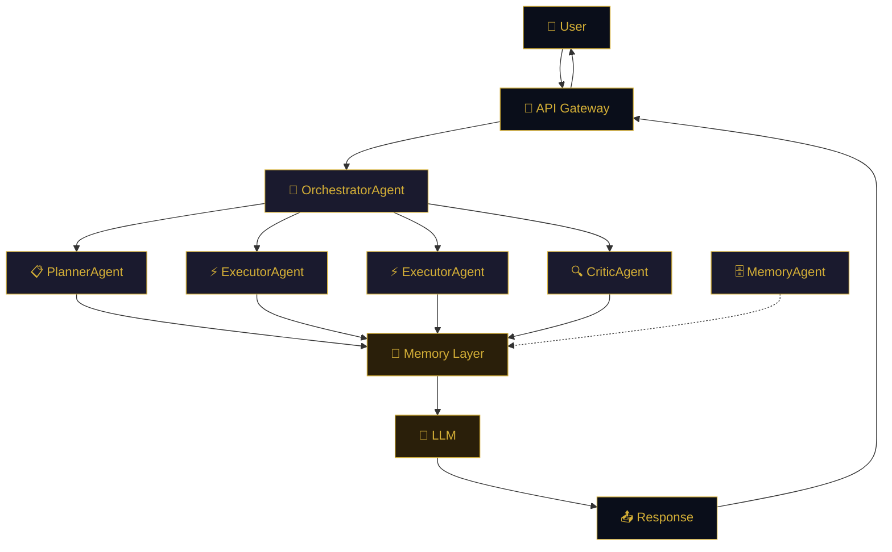

<div align="center">

<!-- Animated header banner — dark navy to gold -->


<!-- Logo -->


<br/><br/>

<!-- Badges row 1 — gold accent (#d4af37) -->
[](https://python.org)
[](LICENSE)
[](#-quick-start-5-minutes)
[](#)

<!-- Badges row 2 — dark navy (#0a0e1a) -->
[](#-architecture)
[](#-how-it-remembers)
[](#-interfaces)

<br/>

> **Your AI runs on your machine. Your data stays on your machine. Period.**
> While other assistants ship your conversations to the cloud and pinky-promise they won't peek, SuperNova keeps everything local — encrypted, inspectable, and under your control.
> No telemetry. No "anonymous" analytics. No "we may use your data to improve our models."
> Just an AI that works *for* you, not *on* you.

<br/>

```
  ╔══════════════════════════════════════════════════════════════╗
  ║                                                              ║
  ║   🧠  4-type persistent memory (semantic · episodic · more) ║
  ║   🤖  Multi-agent orchestration (plan · execute · critique) ║
  ║   🛡️  Granular approval system (you control everything)     ║
  ║   🔮  3D memory visualization (see what it knows)           ║
  ║   💰  Real-time cost tracking (never a surprise bill)       ║
  ║   🏠  100% local-first (your data never leaves)             ║
  ║                                                              ║
  ╚══════════════════════════════════════════════════════════════╝
```

</div>

---

## ⚡ Quick Start (5 Minutes)

```bash
git clone https://github.com/Senpai-Sama7/SuperNova-.git
cd SuperNova
./setup.sh              # installs everything
docker compose up -d    # starts databases
```

Add your API key to `.env`:
```
OPENAI_API_KEY=sk-your-key-here
```

Launch:
```bash
cd supernova && uvicorn api.gateway:app --reload    # API
cd dashboard && npm install && npm run dev           # Dashboard → http://localhost:5173
```

That's it. Type a message and press Enter.

> 💡 *Some AI assistants require a PhD in YAML to configure. We respect your time.*

---

## 🏗️ Architecture

<div align="center">



</div>

> *Other AI tools use a single model and call it "intelligence." We use an orchestrated team of specialized agents — a planner, executors, and a critic — that collaborate, self-correct, and actually think before they act. Novel concept.*

---

## 🧠 How It Remembers

SuperNova has four types of memory — inspired by how human brains actually work:

<div align="center">

| Memory Type | What It Stores | Example |
|:-----------:|:---------------|:--------|
| 🔄 **Working** | Current conversation context | "User is asking about vacation ideas right now" |
| 📚 **Semantic** | Facts about you | "User prefers dark mode, uses VS Code, allergic to nuts" |
| 📖 **Episodic** | Past conversations | "Last Tuesday we planned a birthday party for Sarah" |
| ⚙️ **Procedural** | Learned skills & workflows | "When user asks to deploy, first check git status, then run tests..." |

</div>

> *ChatGPT forgets you exist between sessions. MemGPT has memory but you can't see it. SuperNova lets you explore your memories in a 3D interactive visualization — click, drag, zoom. Verify what it knows. Delete what it shouldn't. Radical transparency.*

---

## 🛡️ The Approval System

When SuperNova wants to do something potentially risky, it stops and asks:

```
  ┌─────────────────────────────────────────────────────────────┐
  │  ⚠️ Approval Request                                       │
  │                                                             │
  │  Tool: send_email                                          │
  │  To: boss@company.com                                       │
  │  Subject: Project Update                                    │
  │                                                             │
  │  Risk Level: ██████████ HIGH                               │
  │                                                             │
  │  ┌─────────────────┐    ┌─────────────────┐                │
  │  │   ✓ APPROVE    │    │   ✗ DENY       │                │
  │  └─────────────────┘    └─────────────────┘                │
  │                                                             │
  │  Auto-resolves in: 4:32                                    │
  └─────────────────────────────────────────────────────────────┘
```

<div align="center">

| Risk Level | Examples | Auto-Resolution |
|:----------:|:---------|:---------------:|
| 🟢 Safe | Search web, read files | ✅ Auto-approves (30s) |
| 🟡 Moderate | Write files, run code | ❌ Denies after 2min |
| 🔴 Risky | Send email, call APIs | ❌ Denies after 5min |
| ⛔ Critical | Delete data, payments | ❌ Denies after 10min |

</div>

> *Open Interpreter runs code without asking. ChatGPT can't run code at all. We found the middle ground — it does things, but only when you say so.*

---

## 🖥️ Interfaces

<div align="center">

```
┌─────────────────────────────────────────────────────────────┐
│                                                             │
│   Web ──── http://localhost:5173       (React dashboard)    │
│   TUI ──── python -m tui              (rich terminal)       │
│   API ──── http://localhost:8000       (REST + WebSocket)   │
│                                                             │
└─────────────────────────────────────────────────────────────┘
```

</div>

### 🌐 Web Dashboard

```
┌─────────────────────────────────────────────────────────────┐
│  ✦ SuperNova                              [Agent: Active]  │
├─────────────────────────────────────────────────────────────┤
│  ┌─────────┐ ┌─────────┐ ┌─────────┐ ┌─────────┐ ┌───────┐│
│  │Overview │ │ Agents  │ │ Memory  │ │Decisions│ │  MCP  ││
│  └─────────┘ └─────────┘ └─────────┘ └─────────┘ └───────┘│
├─────────────────────────────────────────────────────────────┤
│                                                             │
│     ┌─────────────────────────────────────────────────┐     │
│     │         [3D Memory Visualization]               │     │
│     │                                                 │     │
│     │         ✦ ───── ✦                               │     │
│     │        /         \                              │     │
│     │       ✦  Facts   ✦ ─── ✦ Skills                │     │
│     │        \         /                              │     │
│     │         ✦ ───── ✦                               │     │
│     │              │                                  │     │
│     │         ✦ Episodes                              │     │
│     └─────────────────────────────────────────────────┘     │
│                                                             │
│     ┌─────────────────────────────────────────────────┐     │
│     │  💬 Chat                                        │     │
│     │  You: What's my favorite color?                 │     │
│     │                                                 │     │
│     │  SuperNova: From our conversations, you         │     │
│     │  mentioned you love blue — especially deep      │     │
│     │  ocean blue. You said it reminds you of your    │     │
│     │  trips to Hawaii.                               │     │
│     │                                                 │     │
│     │  [ Type your message...                    ]    │     │
│     └─────────────────────────────────────────────────┘     │
└─────────────────────────────────────────────────────────────┘
```

### 💻 Terminal UI

```bash
cd supernova && python -m tui
```

```
┌──────────────────────────────────────────────────────────────┐
│  ✦ SuperNova — AI Agent                                     │
├──────────────────────────────────────────────────────────────┤
│  💬 Chat  │  🧠 Memory  │  🛡️ Approvals  │  📊 Admin  │  📋 Logs │
├──────────────────────────────────────────────────────────────┤
│                                                              │
│  ✦ Welcome to SuperNova                                     │
│    Type a message below and press Enter to chat.            │
│    Use Ctrl+1‑5 to switch tabs, Ctrl+P for commands.        │
│                                                              │
│  ──────────────────────────────────────────────────────────  │
│  [ Send a message to SuperNova…                         ]   │
│                                                              │
│  ● Connected  │  Model: gpt-4o-mini  │  Session: a1b2c3d4  │
└──────────────────────────────────────────────────────────────┘
```

| Key | Action |
|:---:|:-------|
| `Ctrl+1‑5` | Switch tabs |
| `Ctrl+P` | Command palette |
| `Ctrl+Q` | Quit |

---

## 🏆 How SuperNova Compares

<div align="center">

| | SuperNova | MemGPT | Open Interpreter | ChatGPT |
|:--|:---:|:---:|:---:|:---:|
| 100% local | ✅ always | ✅ option | ✅ option | ❌ cloud only |
| Persistent memory | ✅ 4 types | ✅ advanced | ❌ session only | ❌ session only |
| Approval system | ✅ granular | ❌ | ❌ | ❌ |
| Memory visualization | ✅ 3D interactive | ❌ text only | ❌ none | ❌ none |
| Multi-agent system | ✅ orchestrated | ❌ single | ❌ single | ❌ single |
| Local model support | ✅ full | ✅ full | ✅ full | ❌ OpenAI only |
| Cost tracking | ✅ real-time | ❌ | ❌ | ❌ |
| Open source | ✅ MIT | ✅ Apache 2.0 | ✅ MIT | ❌ proprietary |
| Self-reflection | ✅ critic agent | ❌ | ❌ | ❌ |

</div>

> *We're not saying other tools are bad. We're saying we built the one we wanted to use — where you can actually see what the AI knows about you, control what it does, and never worry about your data leaving your machine. If that's not your priority, ChatGPT is one tab away.* 🫖

---

## 📊 Cost Tracking

Never get a surprise AI bill again.

<div align="center">

| Feature | What It Does |
|:--------|:-------------|
| 💰 **Daily budget** | Hard cap on daily spending (default: $10) |
| 📅 **Monthly budget** | Hard cap on monthly spending (default: $100) |
| 🧠 **Smart routing** | Auto-picks cheaper models for simple tasks |
| 📈 **Real-time dashboard** | See spending in the Overview tab |
| 🔔 **Budget alerts** | Warns before you hit limits |

</div>

---

## ⚙️ Settings

<div align="center">

| Preset | Approval | Speed | Best For |
|:------:|:--------:|:-----:|:---------|
| 🔒 **Maximum** | Everything | Slow | Sensitive work |
| ⚠️ **Careful** | Risky only | Medium | Daily use |
| ⚖️ **Balanced** | Smart defaults | Medium | Recommended |
| 🚀 **Fast** | Nothing | Fast | Trusted tasks |

</div>

Fine-grained controls: risk thresholds, tool access toggles, self-reflection, query caching, model selection.

---

## 📡 API Reference

| Method | Endpoint | Description |
|:------:|:---------|:------------|
| `GET` | `/health` | Server status |
| `POST` | `/api/v1/agent/message` | Send a message |
| `WS` | `/agent/stream/{id}` | Real-time chat |
| `GET` | `/memory/semantic` | Browse memories |
| `GET` | `/admin/costs` | View spending |
| `GET` | `/api/v1/preferences` | Get settings |
| `POST` | `/api/v1/preferences` | Update settings |
| `POST` | `/api/v1/preferences/preset/{name}` | Apply preset |

---

## 🔧 What's Under the Hood

<div align="center">

| Service | Purpose | Why |
|:-------:|:--------|:----|
|  | Memories & skills | Durable, queryable storage |
|  | Fast cache | Sub-millisecond lookups |
|  | Conversation timeline | Graph-based episode linking |
|  | AI observability | Performance tracking (optional) |

</div>

You don't need to touch any of these — `docker compose up -d` handles everything.

---

## 🧪 Self-Healing & Error Handling

<details>
<summary><b>💪 What auto-recovers</b> (click to expand)</summary>

| Scenario | What Happens |
|:---------|:-------------|
| Database service down | Auto-reconnects on next request |
| Corrupt memory entry | Skipped gracefully — others unaffected |
| API key expired | Clear error + falls back to cheaper model |
| Budget exceeded | Blocks requests with friendly message |
| Docker not running | Setup script detects and guides you |

</details>

<details>
<summary><b>🚫 What doesn't recover (by design)</b> (click to expand)</summary>

- **Deleted database volumes** = memories gone. Back up your Docker volumes.
- **Lost API key** = can't call cloud models. Get a new key.
- **Corrupted Neo4j graph** = episode links lost. Semantic memory survives.

</details>

---

## 📁 Project Structure

```
SuperNova/
├── dashboard/          # React web interface + 3D memory viz
├── supernova/          # Core AI system
│   ├── api/            # FastAPI gateway
│   ├── agents/         # Orchestrator, Planner, Executor, Critic
│   ├── memory/         # 4-type memory system
│   ├── loop.py         # Agent thinking loop
│   ├── context_assembly.py  # Context building
│   └── interrupts.py   # Approval system
├── docker-compose.yml  # Database services
├── setup.sh            # One-command install
└── .env                # Your settings
```

---

## 🤝 Contributing

```bash
git clone https://github.com/Senpai-Sama7/SuperNova-.git
cd SuperNova
./setup.sh
# Make changes, then:
python -m pytest tests/ -v
```

---

<div align="center">

## 📜 License

MIT — free to use, modify, and distribute.

*Your AI. Your data. Your rules.*

<br/>


<br/><br/>


</div>
