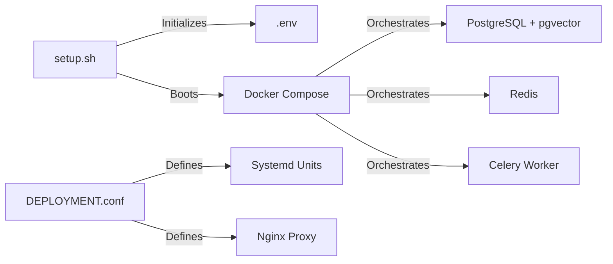

# SuperNova: System Relation Knowledge Graph (Source of Truth)

This document serves as the formal specification of the SuperNova architecture, mapping the inter-component relationships, data flows, and functional hierarchies.

## 1. The Cognitive Core (The Brain)

```mermaid
graph TD
    subgraph "Cognitive Engine (core/)"
        Loop[loop.py: Central Executive]
        Assembler[context_assembly.py: Attention Scheduler]
        ProcMem[procedural.py: Skill Manager]
        Router[dynamic_router.py: Resource Optimizer]
        Interrupts[api/interrupts.py: Safety Coordinator]
    end

    Loop -->|Optimizes Context| Assembler
    Loop -->|Retrieves Skills| ProcMem
    Loop -->|Routes Calls| Router
    Loop -->|Pauses for HITL| Interrupts

    subgraph "Memory Layers"
        Episodic[Graphiti: Temporal Graph]
        Semantic[pgvector: Vector Store]
        ProceduralStore[mcp_and_skills/skills: Subgraph Library]
    User([User Request]) --> Loop[loop.py: Cognitive Loop]
    Loop --> Retrieval[memory_retrieval_node]

    subgraph Memory
        Retrieval --> Episodic[(Graphiti: Episodes)]
        Retrieval --> Semantic[(pgvector: Facts)]
        Retrieval --> Procedural[(Skills: Procedural)]
        Retrieval --> Redis[(Working Memory)]
    end

    Loop --> Assembly[context_assembly.py]
    Assembly --> Router[dynamic_router.py]
    Router --> LLM[LLM Provider: Claude/Gemini/Llama]

    LLM --> Decision{Action Required?}
    Decision -- Tool Call --> Safety[interrupts.py: Safety Layer]
    Safety -- Approved --> Bridge[.agent/mcp-bridge.py]
    Bridge --> Tools[MCP Tool Suite]

    Tools --> Loop
    Decision -- Response --> Consolidate[Consolidation Node]
    Consolidate --> Episodic
    Consolidate --> Redis
    Consolidate --> User
```

---

## 🔮 7. Future Evolution Path

1. **Self-Evolution**: Agents capable of generating new `.skill` files and committing them to `procedural.py`.
2. **Federated Memory**: Cross-session knowledge sharing across the SuperNova swarm via Graphiti sync.
3. **Advanced Uncertainty**: Moving from simulated Bayesian metrics to real-time conformal prediction on tool success rates.

---

## 3. Infrastructure & Deployment (The Skeleton)



---

## 4. Current State vs. Future Evolution

| Component         | Current State (SuperNova v1.0)  | Future Projection (FAANG-Tier)                           |
| :---------------- | :------------------------------ | :------------------------------------------------------- |
| **Cognition**     | Centralized in `loop.py`.       | Multi-agent swarms with local/global consensus.          |
| **Observability** | Langfuse traces + local logs.   | Predictive failure telemetry & cost-threshold alerts.    |
| **Security**      | Path jailing & HITL interrupts. | gVisor sandbox isolation & zero-trust tool access.       |
| **UX**            | CLI-first with React Dashboard. | Voice-integrated, modal-agnostic "ambient" intelligence. |

---

> [!NOTE]
> This graph is dynamic. As skills are "crystallized" (moved from reasoning traces to compiled procedural memories), the weight of the system shifts from `REASON` (high cost) to `PRIME` (low cost, high precision).
